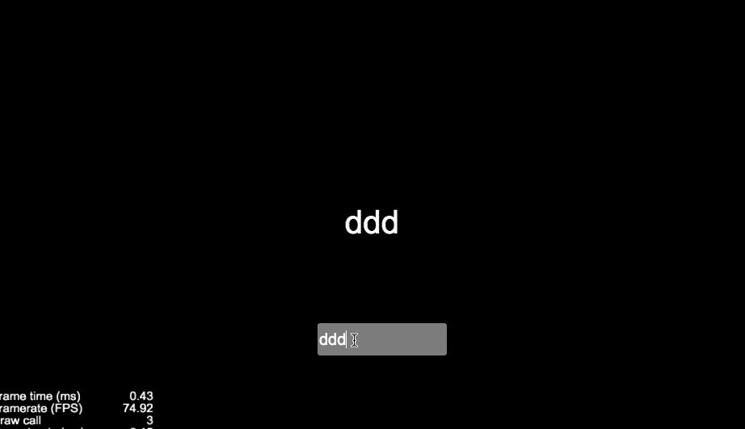

## 说明
借鉴vue实现的一个简单的观察者，当观察的数据变化的时候自动触发刷新ui的回调函数。如有错误，望斧正。
## 环境

cocos creator 2.1.0
vue源码：https://github.com/vuejs/vue
ccc-vue 源码：https://github.com/interfacekun/ccc-vue.git

## 使用
1. 工程引入ccc-vue；
2. 观察数据 new Vue(data)；
3. 订阅数据的变化 Vue.bind(new Watcher...)；
4. 修改数据自动触发绑定的更新ui回调函数。

## 例子代码
```javascript
// hello.ts 部分
    @property(cc.Label)
    label: cc.Label = null;
    _vm: Vue | any = null;
    _watcher: Watcher | any;

    start () {
        // 观察
        this._vm = new Vue({label: "Hello world!"});
        // 订阅
        this._watcher = Vue.bind(new Watcher(this._vm, this.setLabelString, this), this._vm.label);

        // 取消订阅
        // watcher.teardown();
    }

    setLabelString(vaule: string, oldValue: string) {
        if (!vaule) vaule = "Hello world!";
        this.label.string = vaule;
    }

    // EditBox值改变的回调函数
    textChange(value, target) {
        // 值变化自动触发 setLabelString 刷新ui
        this._vm.label = value;
    }


```

## 效果图
